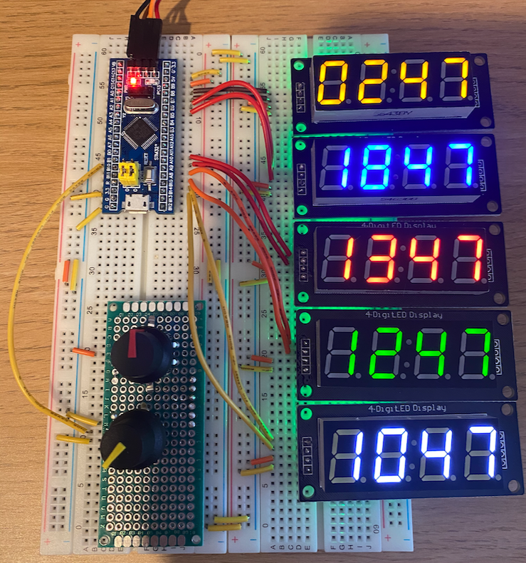

# tzclock-rs

A learning exercise in embedded Rust to produce a digital clock showing five time zones.

## Design

* STM32F103C8T6 MCU ("Blue Pill")
* 5 x TM1637 4 digit 7-segment displays
* 24 pulse rotary encoder with push button
* 10k linear potentiometer

## Function

UTC is used as the reference time, each display is assigned an offset from this time.

The potentiometer controls the brightness of the 7-segment displays.

The rotary encoder's push button cycles through the following modes:

* `normal`
  * Time is shown on all displays
  * Dial has no effect
* `set_hours`
  * UTC time is shown on display 0 and
  * Dial adjusts hours
* `set_minutes`
  * UTC time is shown on display 0
  * Dial adjusts minutes
* `set_offset_0`
  * Each offset is shown on all displays
  * Display 0 flashes
  * Dial adjusts offset of display 0
* `set_offset_1`
  * Each offset is shown on all displays
  * Display 1 flashes
  * Dial adjusts offset of display 1
* `set_offset_2`
  * Each offset is shown on all displays
  * Display 2 flashes
  * Dial adjusts offset of display 2
* `set_offset_3`
  * Each offset is shown on all displays
  * Display 3 flashes
  * Dial adjusts offset of display 3
* `set_offset_4`
  * Each offset is shown on all displays
  * Display 4 flashes
  * Dial adjusts offset of display 4